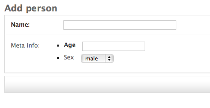
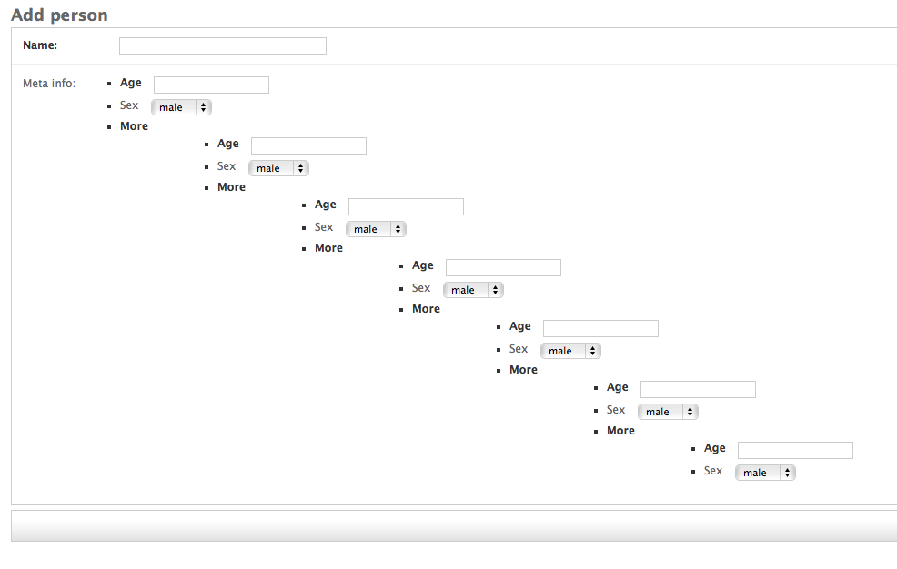

.. _getting_started:

===============
Getting Started
===============

django-formfield is a form field that accepts a django form as its first argument, and validates 
as well as render's each form field as expected. Yes a form within a form, *within a dream*? There 
are two types of fields available, :ref:`api_formfield` and :ref:`api_model_formfield`. For 
:ref:`api_model_formfield` the data is stored in json. For :ref:`api_formfield` data is simply 
returned as a python dictionary (form.cleaned_data)

Example
=======

::

    from django.db import models
    from django import forms
    
    from formfield import ModelFormField

    class PersonMetaForm(forms.Form):
        age = forms.IntegerField()
        sex = forms.ChoiceField(choices=((1, 'male'), (2, 'female')), required=False)
        

    class Person(models.Model):
        name = CharField(max_length=200)
        
        meta_info = ModelFormField(PersonMetaForm)

Which will result in something like this (using the admin)

The :ref:`api_model_formfield` is automatically set to `null=False`, `blank=False`, this is 
because validation is done on the inner form. As a result you will see something like the 
following if we hit save on the change form:

.. image:: ss002.png

If we supply the change for valid data you should get a python dictionary when retreiving 
the data::

    >>> person = Person.objects.get(pk=1)
    >>> person.meta_info
    {u'age': 12, u'sex': u'1'}
    
The form is the only thing forcing input of the expected values, behind the scenes the 
data is being serialized into json. Therefore on the python level we can supply meta_info 
any valid json:::

    >>> from sample_app.models import Person
    >>> data = {'some': 'thing', 'is': 'wrong', 'here': 'help!'}
    >>> p = Person.objects.create(name="Joan", meta_info=data)
    >>> p.meta_info
    {'is': 'wrong', 'some': 'thing', 'here': 'help!'}
    
.. note::

    If the form field is being made available via a form change, such as the admin, any 
    unexpected value will be overriden by what the form returns . For example, the 
    PersonMetaForm only expects `age` and `sex`, so none of the values above 
    ('is', 'some' and 'here') match and will be overridden when the form submitted. 
    
    We can however, make the field hidden or readonly and use it like above.
    
Form within a form within a form within a form within a form.....
=================================================================

Sure its possible..

